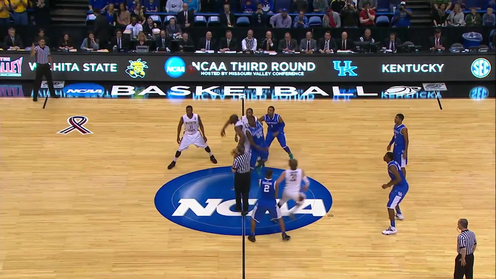
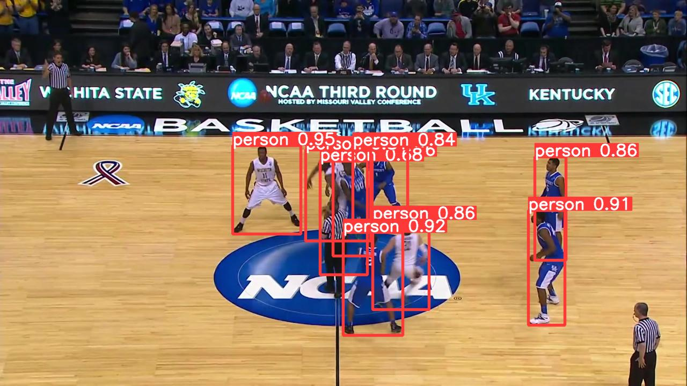

# IC🫵 : Multiple Object Detection in the Domain of Basketball
<p align="center">
  
  
  
</p>


# To run on the SportsMOT dataset
## 1) Download data from https://github.com/MCG-NJU/SportsMOT
## 2) Pick a model to run on
   ### SSD or Faster RCNN
   ``` python ./object_detection/eval.py --model <enter model of choice> ```
   ### Yolov8
   ``` python ./object_detection/eval_yolov8.py ```
   ##### Note: You may finetuine by running:
   ``` python ./object_detection/finetune_yolov8.py ```
   ##### Then run the following to use the fine-tuned weights
   ``` python ./object_detection/eval_yolov8.py --weights <insert weight path> ```
   ### Detectron2
   ``` run command: python ./object_detection/eval_detectron2.py ```
   #### Note: You may finetuine by running:
   ``` python ./object_detection/finetune_detectron2.py ```
   #### Then run the following to use the fine-tuned weights: 
   ``` python ./object_detection/eval_detectron2.py --weights <insert weight path> ```

   
